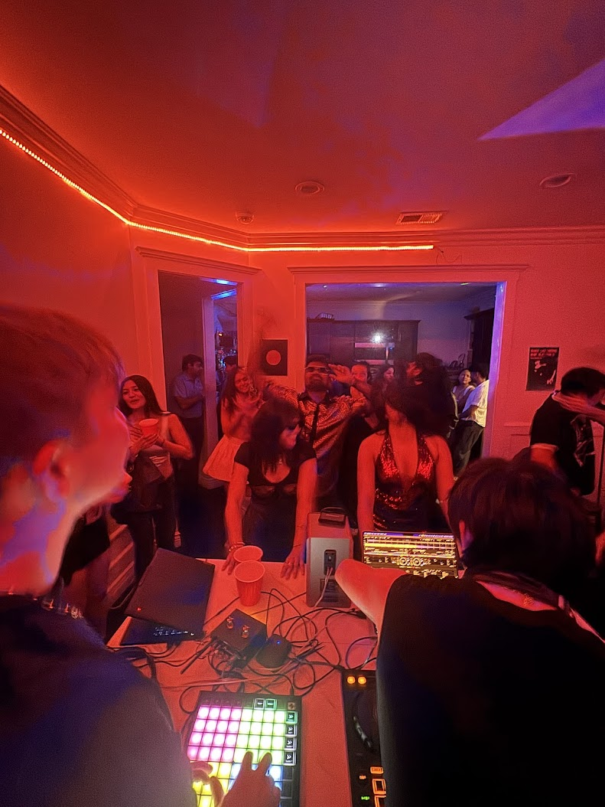
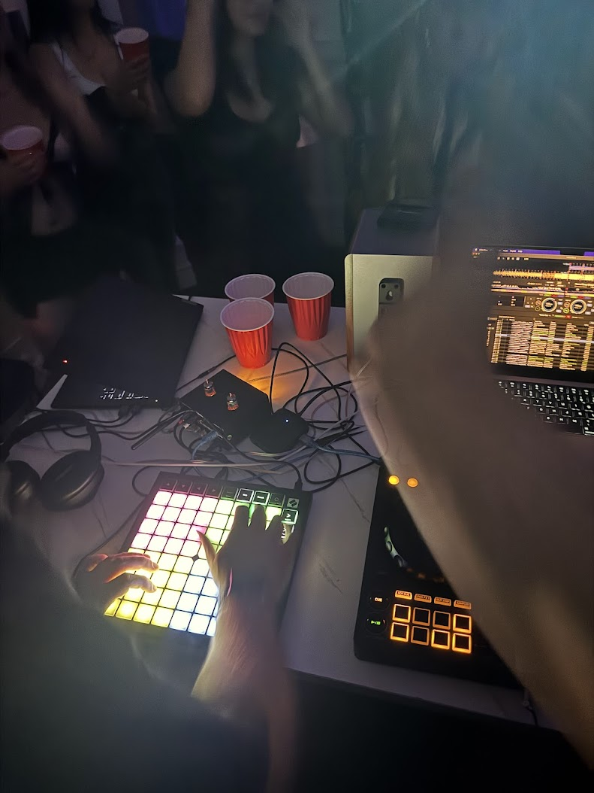
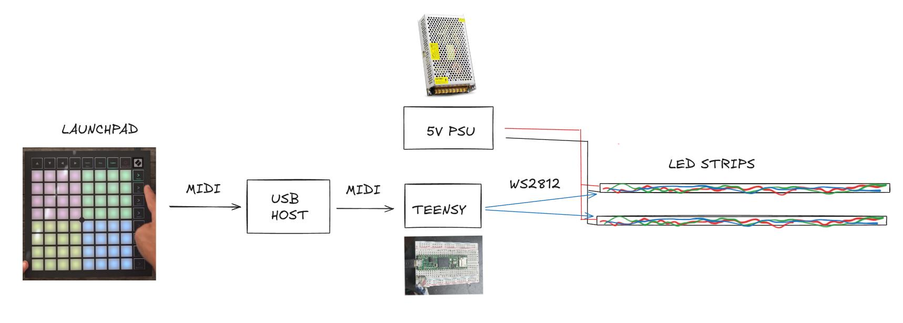
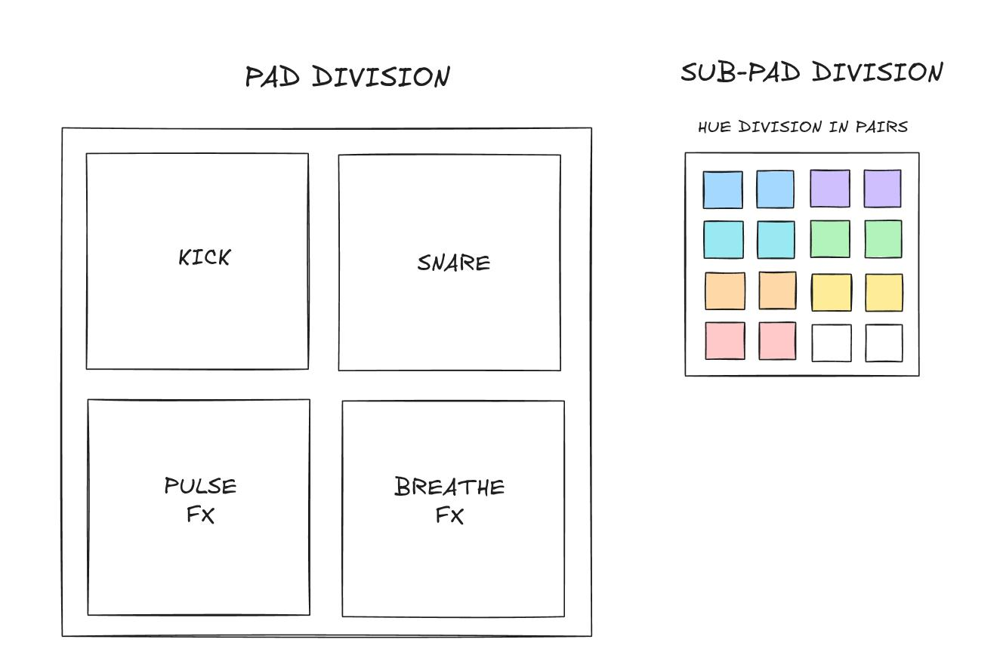
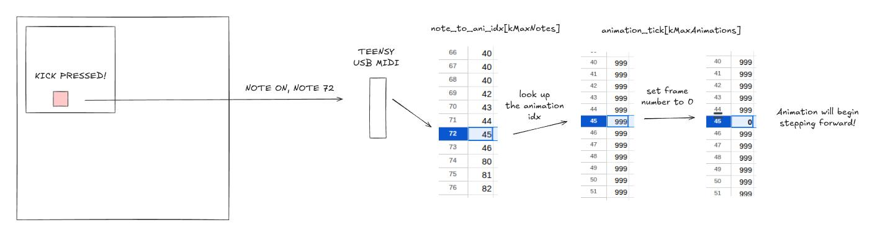
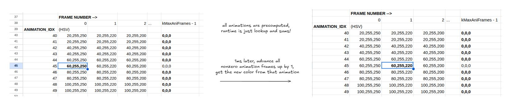
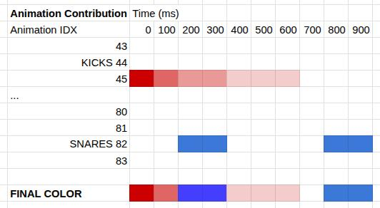

# lightdrive
Launchpad MIDI controlled light show performance on a Teensy.
<!--  -->


# How does it work?

## System Design

We use a Launchpad X to send MIDI to a Teensy 4.1 microcontroller over USB. Each note triggers an animation on the Teensy, which is connected to two 300-LED strips around the room. More LEDs can be added by chaining strips or by using more GPIOs.

## Lighting Mapping


The Launchpad X is divided into four quadrants, each controlling a different genre of lights. Each Sub pad is split into 8 groups of colors, two adjacent keys are the same color so you can "double tap" them side by side for extra fast triggering.

## Animation
Animations play in four high level steps:
1. USB Midi Event triggers animation start: set the corresponding animation frame number to zero
2. For any animation in progress, determine their current lighting contribution
3. For all animations, add their current colors together
4. Play the color onto the entire strip

There are exceptions for stateful animations that also need to loop once reaching the end of the animation / need to be record `MIDI Note Off` to turn off the animation. The moving pulse animations also are exceptionally added at the end.

The below diagrams help explain:

### 1. Look up the animation index per note, and set the frame number to zero.

- The array `note_to_ani_idx[kMaxNotes]` looks up the right animation per `midi note`. This is useful if you want to bind multiple `keys` to the same `animation`. This is very useful if you want remap quadrants/colors without shuffling animations around. In the future this will also be useful for dynamically changing performance modes.
- In the screen shot, you can see multiple `notes` have been bound to animation number `40` for example.
- `animation_tick` stores the current `frame number` that the animation is at. Currently there are `1000` frames per animation.

### 2. Look up the current animation contribution

- The main loop will add one to all frame numbers in `animation_tick` if it is non zero, and we can see this progresses down the animation. What is shown is an example of a `kick` might exponentially decrease its `Value` part of the `HSV` as the `frame number` progresses.
- In the screenshot you can see multiple animations sharing the same full animation array. This is how I chose to have adjacent keys play the same colors. I could have also used less animations but whatever.
 
### 3. Sum all animations contributions together

- The Diagram shows a `red kick` being pressed at `100ms` and a `blue snare` being hit at `200ms` + `800ms`.
- THe decreasing brightness of the `red kick` is a result of the pre-programmed decay into the `red kick` animation. Where as the `blue snare` animation is constant brightness for a very short duration.
- The `FINAL COLOR` is a `saturating` summation of all the colors.
- **This summation strategy allows any combination of keys to be pressed at the same time**, the most satisfying combination to hit is a multiple snares being hit right after a kick, shown in the diagram.

## AI Usage:
I have done a similar project in the past, and tried to use AI for this and it fumbled miserably, it struggles to maintain correctness with indicies / multiple lookups. I knew going into this project that it would take much longer to write out all the lookup strategies that I would want it to use, and so instead I wrote all the lookup, animation progression, and summation code. It didn't take _that_ long.

But nonethless, AI is still useful for getting up pieces of code that you know will not be the bottleneck in the project.

What did I actually end up using AI for?
- Cutting over to use `OctoWS2811` for faster refresh
- Bootstrapping the MIDI usb protocol reading
- Writing python `midi` generators for smoke testing
- I started drinking while programming, I made it do the `breathing fx` and the `pulse wave fx` because I stopped being able to leet code.

We managed to finish the project about `15 mins` before the `NYE Rave` started.

## Failures / Things I would change
- Ideally I also wanted to have a performance mode where it would just listen to `midi clock out` from some DJ source, but `rekordbox` (my friend's dj software) had no easy way to get it out.
- Bruh I hung up my LED strips backwards so many times, don't do this
- Probably buy a hardware MIDI usb hub, my laptop going to sleep was very annoying

# Developer Notes / Dump

## Principles
AI Usage:
- AI usage is ok, as long as we do not sacrifice learnings. Its biggest tools here will be cleaning things up, and bootstrapping.

## Installation Notes
1. Git clone
2. Install platformio extension into vscode.
3. Install teensy rules:
   1. https://www.pjrc.com/teensy/00-teensy.rules
4. Run `pio run -e teensy_blink -t upload`

## Debug Tools
```
ls /dev/tty*
```

## Event Flow

Here is some output from `aseqdump -p 32:1`

```
Source  Event                  Ch  Data
 24:0   Note on                 0, note 60, velocity 96
 24:0   Note on                 0, note 64, velocity 88
 24:0   Note on                 0, note 67, velocity 92
 24:0   Polyphonic aftertouch   0, note 60, pressure 34
 24:0   Polyphonic aftertouch   0, note 64, pressure 41
 24:0   Polyphonic aftertouch   0, note 67, pressure 29
 24:0   Polyphonic aftertouch   0, note 60, pressure 55
 24:0   Polyphonic aftertouch   0, note 64, pressure 63
 24:0   Note off                0, note 64, velocity 0
 24:0   Polyphonic aftertouch   0, note 60, pressure 72
 24:0   Note off                0, note 67, velocity 0
 24:0   Note on                 0, note 72, velocity 101
 ```


# Dev Log

## 2055.12.28
Goals:
- I want to accurately control the LEDs around my room.
- I want to receive MIDI on the teensy, and send it to the light strip around my room.

Learnings:
- Things will start to fall apart once we have too many LEDs and we may have trouble reading from serial:
- https://github.com/FastLED/FastLED/wiki/Interrupt-problems
- ```
    fill_rainbow(rightStrip, NUM_LEDS, 0, 1); // Be careful if you ever feed a hue delta that's less than 1. Delta hue is a uint8_t.
    ```
Objectives:
- Determine if this is worth doing in the living room.

Notes:
- Right now my bedroom setup has two strips of 300. A WS2812 LED takes about `30us` to update one LED. Pushing down a whole strip of 300 down one wire will then take `9ms`. FastLED, unless configured will drive them sequentially meaning that two strips of `300` will take `18ms`. If I go to the living room with two strips of `600`, it will take `36ms`. Aka 30 fps. Unacceptable.
- https://github.com/FastLED/FastLED/wiki/Parallel-Output
- Let's try to do better

### Octo WS2811
Notes:
- https://www.pjrc.com/teensy/td_libs_OctoWS2811.html

## 2025.12.30

I will need this tomorrow:

```
lsusb | grep -i novation
aconnect -l
aseqdump -p "Launchpad X MIDI 1"
aconnect "Launchpad X MIDI 1" "Launchpad X MIDI 1"
```

Proof of concept:
```
python scripts/send_midi.py
pio run -e lightdrive3 -t upload
```
This will do:
```
Python -> MIDI -> (USB Host/MIDI/ALSA?) -> MIDI over USB -> Teensy -> LightDrive Program
```

Nice.

---

Mappings

Bottom Left
- [36, 52)
- Sustained looks (wash, glow, color fields)

Top Left
- [52, 68)
- Beats / hits (kick flashes, strobes)

Bottom Right
- [68, 84)
- Transitions (builds, drops, blackouts)

Top Right
- [84, 100)
- Accents (snare, off-beat, syncopation)

---

Fast upload:
```
pio run -e lightdrive3 -t upload && sleep 1 && aconnect 32:1 24:0
```